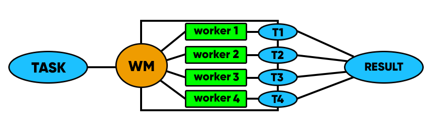

# Worker-Manager

[](https://app.codacy.com/app/a-kuharenko/worker-manager?utm_source=github.com&utm_medium=referral&utm_content=a-kuharenko/worker-manager&utm_campaign=Badge_Grade_Dashboard)

## **Worker-manager based on worker_threads**
This facade above 'worker_threads' allows to run parallel calculations with avoiding work with SharedArrayBuffer and Atomics.
General idea:


### Documentation 1
*./master.js*
```js
const { WorkerManager } = require('./worker_manager');
const wm = new WorkerManager(workersAmount, path, setHandlers);
```  
      workersAmount:         Number{number of workers}
      path:                  String{path to worker}
      setHandlers(optional): Function{set events handlers for workers}
                              args: worker
                                worker: Class{worker from worker_threads}
                              returns: worker
      
      properties:
          wm.workers:         Array{array of workers}
          wm.workerAmount:    Number{number of workers}
          wm.array:           Int32Array{array from buffer with data}
     
      methods:
          wm.sendData(task)
              arguments:
                  task: Array{array with data for processing by workers}
              
              returns: 
                  Void
                
              does: 
                  creates buffer with data from array and bufferLock. Send for each worker
                  postMessage with workerData.
              
           wm.runTask(callback)
               arguments:
                  callback: Function{what gets called when task is completed}
                      args: data
                          data: Returns{workers result}
                      
               returns: 
                   Void
                  
               does: 
                   Send for each worker message with data: 'start' and set event handler
                   on event 'message' with data: 'done', which increases wm.finished and
                   calls callback, when wm.finished === wm.workersAmount
                   
            wm.killWorkers()
                does:
                    Terminate all workers.
                    
*./worker.js*   
```js
const { WmWorker } = require('./worker_manager');
const worker = new WmWorker(fn, setHandlers);
````

      fn:                    Function{function which will applied for every element of task}
      setHandlers(optional): Function{set events handlers for parentPort}
                              args: parentPort
                              
      properties:
          worker.id:       Number{id of WmWorker}
          worker.array:    Int32Array{array from buffer with data}
          worker.fn:       Function{function which will applied for every element of task}
          worker.lock      Int32Array{array from buffer which contains lock/unlocked flags of task}
                              
      does: WmWorker processes task array with other WmWorkers and sends postMessage to 
      parentPort with data: 'done', when WmWorker finished his work.
      
### Using WM above worker_threads
*./master.js* 
```js
'use strict';

const { WorkerManager } = require('./worker_manager');

const task = new Array(100000).fill(0).map((value, index) => value + index);
const setHandlers = worker => {
  worker.on('message', (message) => {
    if (message.data === 'done')
      console.log(`Worker ${message.id} is done`);
  });

  worker.on('error', err => {
    console.log(err);
  });

  worker.on('exit', code => {
    console.dir({ code });
  });
  return worker;
};

const wm = new WorkerManager(4, './worker.js', setHandlers);
wm.sendData(task);
wm.runTask(res => {
  console.log(res);
  wm.killWorkers();
});
```
*./worker.js*
```js
'use strict';

const { WmWorker } = require('./worker_manager');
const fs = require('fs');

const fn = id => {
  const data = fs.readFileSync(`${__dirname}/source/file_${id}.txt`);
  const matches = data.toString().match(/2/g);
  return matches !== null ? matches.length : 0;
};

const setHandlers = worker => {
  worker.on('message', (message) => {
    if (message.data === 'start')
      console.log(`Worker ${message.id} is started`);
  });
};
new WmWorker(fn, setHandlers);
```

## **Worker-manager based on cluster**
This facade above 'cluster' allows to split up the task between workers and put together the results of their parallel work. 
General idea:


### Documentation 2 
*./master.js*
```js
const WorkerManager = require('./worker_manager');
const wm = new WorkerManager(workersAmount, setHandlers);
```  
      workersAmount:         Number{number of workers}
      setHandlers(optional): Function{set events handlers for workers}
                              args: worker
                              returns: worker
      
      properties:
          wm.workers:         Array{array of workers}
          wm.partsAmount:     Number{number of active subarrays with task for workers}
          wm.tasks:           Array{array with subarrays for every worker}
     
      methods:
          wm.setTask(task)
              arguments:
                  task: Array{array with data for processing by workers}
              
              returns: 
                  Void
                
              does: 
                  Split up the task on subarrays for every worker
              
           wm.runTask(callback)
               arguments:
                  callback: Function{what gets called when task is completed}
                      args: data
                          data: Returns{workers result}
                      
               returns: 
                   Void
                  
               does: 
                   Send task for each worker and set event handler
                   on event 'message', which collects result of work and
                   calls callback, when active tasks ran out.
                   
            wm.killWorkers()
                does:
                    Terminate all workers.
                    
### Using WM above cluster
*./multicore.js* 
```js
'use strict';

const cluster = require('cluster');

if (cluster.isMaster) {
  require('./master.js');
} else {
  require('./worker');
}
```
*./master.js* 
```js
'use strict';

const WorkerManager = require('../worker_manager');

const task = new Array(10000000).fill(0).map(() => 10);
const workersAmount = 4;

const setHandlers = worker => {
  worker.on('exit', () => {
    console.log(`Worker ${worker.process.pid} was killed`);
  });

  worker.on('message', () => {
    console.log(`Master recieved a result from Worker ${worker.process.pid}`);
  });
  return worker;
};

const wm = new WorkerManager(workersAmount, setHandlers);
wm.setTask(task);
wm.runTask((result) => {
  console.log(result);
});
```
*./worker.js*
```js
'use strict';

const fn = x => parseInt(Math.pow(x, x) /
  Math.log10(x) * Math.tan(x * Math.random()));

process.on('message', message => {
  const result = message.task.map(fn);
  process.send({ result, id: message.id });
});
```
